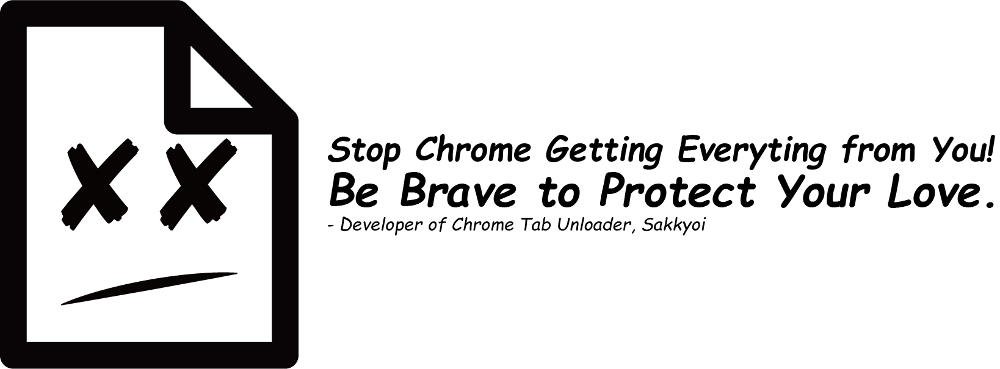
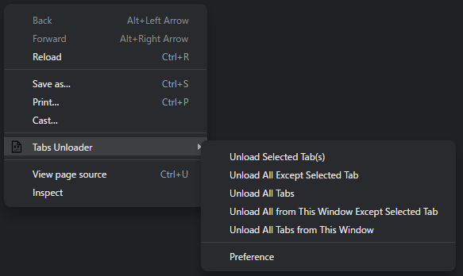
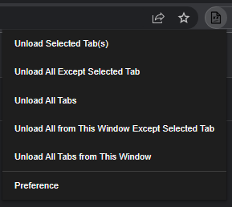
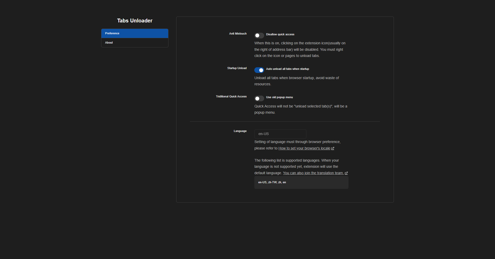

# Tabs Unloader 2.0

An extension recapture your own memory from browser.

## Download from extension store

 

## Features

- No tab disappearing. Just unload it.
- Simple to use. Just click your mouse.
- No more memory waste. Recapture your own memory.

## New in 2.0

- Brand new operating procedure
- Anti mistouch
- Startup unloader
- Performance improve

## Installation

Guide for *load an unpacked extension* from [*chrome developers docs*](https://developer.chrome.com/docs/extensions/mv3/getstarted/#unpacked):
#### 1. Open the Extension Management page by navigating to `chrome://extensions`.
- Alternatively, open this page by clicking on the Extensions menu button and selecting *Manage Extensions* at the bottom of the menu.
- Alternatively, open this page by clicking on the Chrome menu, hovering over *More Tools* then selecting *Extensions*
#### 2. Enable Developer Mode by clicking the toggle switch next to *Developer mode*.
#### 3. Click the *Load unpacked* button and select the extension directory.
Ta-da! The extension has been successfully installed. Because no icons were included in the manifest, a generic icon will be created for the extension.

OR, you can just [download from extension store](#download-from-extension-store)

## Usage
#### You can unload your tabs from:
- context menu on pages
- context menu on quick access button (new operating procedure)
- directly clicking on quick access button (new operating procedure)

> Quick access button is the extension icon usually on the left of address bar

> Quick access button will be "unload selected tab(s)" when directly clicking on it in generally

> Quick access button can set to the popup menu from old version

#### There are five mode to unload: (different from old version)

| Mode | Description |
| :--- | :---------- |
| Unload Selected Tab(s) | Unload selected tabs contain current tab |
| Unload All Except Selected Tab | Unload all of the tabs you opened but not contain selected tabs |
| Unload All Tabs | Unload all of the tabs you opened |
| Unload All from This Window Except Selected Tab | Unload all of the tabs you opened from current window but not contain selected tabs |
| Unload All Tabs from This Window | Unload all of the tabs you opened from current window |

#### Description of preference options:

| Option | Description |
| :----- | :---------- |
| Anti Mistouch | Disallow quick access to disable directly clicking on quick access button |
| Startup Unload | Auto unload all tabs when browser startup to avoid waste of resources |
| Triditional Quick Access | Directly clicking on quick access button will not be "unload selected tab(s)", it will be a popup menu from old version |

## Gallery

- Context menu on pages

- Context menu on quick access button

- Popup menu in triditional quick access button

- Preference page

